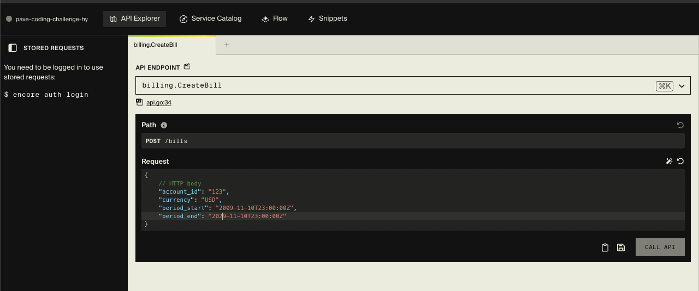

# Billing API

This project is a billing API built using [Encore](https://encore.dev) and [Temporal](https://temporal.io) to manage billing workflows. The API allows creating, updating, and querying bills and their line items.

This service uses a CQRS pattern, where commands are handled via temporal and reads are done via Postgres Database queries

The heavy lifting of event sourcing and event logs persistence are done by Temporal

## Features

1. Create new bills.
2. Add line items to an existing open bill.
3. Close an active bill and get total charged amount.
4. Reject adding line items if a bill is already closed.
5. Query open and closed bills by status and account ID.
6. Retrieve a bill along with all its line items.

## Prerequisites

To run this project locally, you’ll need to have the following installed:

- [Go](https://golang.org/doc/install)
- [Docker](https://www.docker.com/get-started)
- [Encore](https://encore.dev/docs/install)
- [Temporal CLI](https://docs.temporal.io/docs/server/quick-install)

## Setup

### 1. Clone the repository

```bash
git clone https://github.com/yourusername/billing-api.git
cd billing-api
```
### 2. Run temporal CLI
```bash
temporal server start-dev
```
### 3. Run the application

Navigate to the repo folder
```bash
encore run
```
You should see the console output something like this
```
...

Encore development server running!

Your API is running at:     http://127.0.0.1:4000
Development Dashboard URL:  http://localhost:9400/aap7e
```
### 4. Trigger the REST API

Open the URL for the dashboard and trigger the APIs


## Unit Tests
run this:
```
encore test ./...
```

## Areas for improvement
- Unit tests for API
- API input validation
- Multi currency bills handling
  - currency table to store precision
  - separate service to query current exchange rate
  - 1 bill to have 1 settlement currency, and items can be of other currencies
- Publish events to message queue for other services to consume
  - line item added (Eg. notifications service, user behaviour analysis system)
  - bill opened/closed (Eg. notifications service, rewards system)
